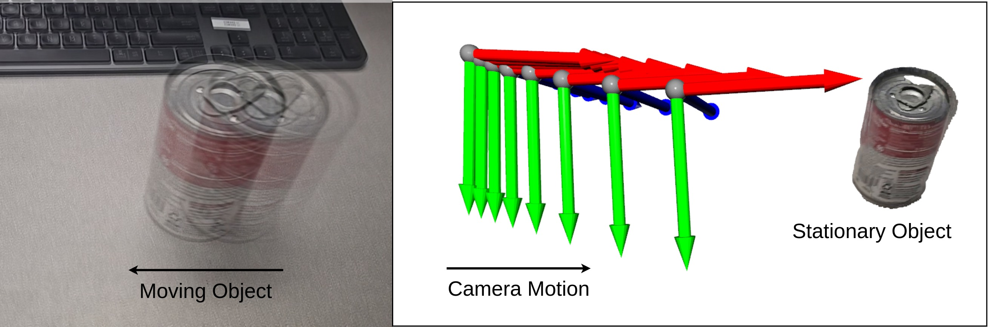

# Flow to 3D: Reconstructing a Moving Object from Monocular RGB Video

We present our project Flow to 3D, built on top of [SEA-RAFT](https://github.com/princeton-vl/SEA-RAFT). We primarily rely on optical flow to find pixel correspondences because we have a stationary monocular RGB video and a rigid-body object moving in the video. From these pixel correspondences, we are able to recover the camera poses and 3D point cloud. We then use a sliding window approach to refine camera poses and the point cloud.

This is the final course project for 16-822 (Geometry-based Methods in Vision) by [George Wei](https://gzhihongwei.github.io) and [Kallol Saha](https://kallol-saha.github.io/).



## Requirements

Our code is developed with pytorch 2.2.0, CUDA 12.2 and python 3.10.

```Shell
conda create --name flow_to_3d python=3.10.13
conda activate flow_to_3d
pip install -r requirements.txt
pip install -e .
```

## How to run

To visualize the optical flow and correspondences, run

```Shell
python generate_flow_seg.py \
--video_path assets/can.mp4 \  # Look in assets/ for more videos
--batch 10
```

Place any videos (\*.mp4), camera intrinsics (\*.npy) in `assets/`. To run an example, run the following

```Shell
python reconstruct.py \
--intrinsics_path assets/intrinsics.npy \
--video_path assets/can.mp4 \  # Look in assets/ for more videos
--thresh 10 \
--skip 2
```

## Acknowledgements

This project relies on code from [SEA-RAFT](https://github.com/princeton-vl/SEA-RAFT). Very thankful for producing such a good optical flow model!
